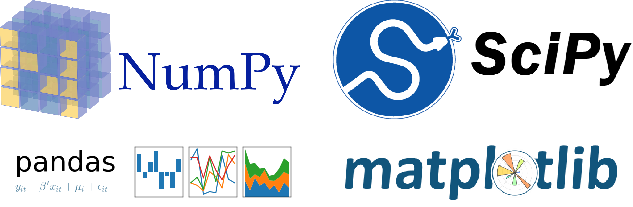

## Python

### Numpy

NumPy is a general-purpose array-processing package. It provides a high-performance multidimensional array object, and tools for working with these arrays.

It is the fundamental package for scientific computing with Python. It contains various features including these important ones:

1.A powerful N-dimensional array object

2.Sophisticated (broadcasting) functions

3.Tools for integrating C/C++ and Fortran code

4.Useful linear algebra, Fourier transform, and random number capabilities

Besides its obvious scientific uses, NumPy can also be used as an efficient multi-dimensional container of generic data.

Arbitrary data-types can be defined using Numpy which allows NumPy to seamlessly and speedily integrate with a wide variety of databases.
